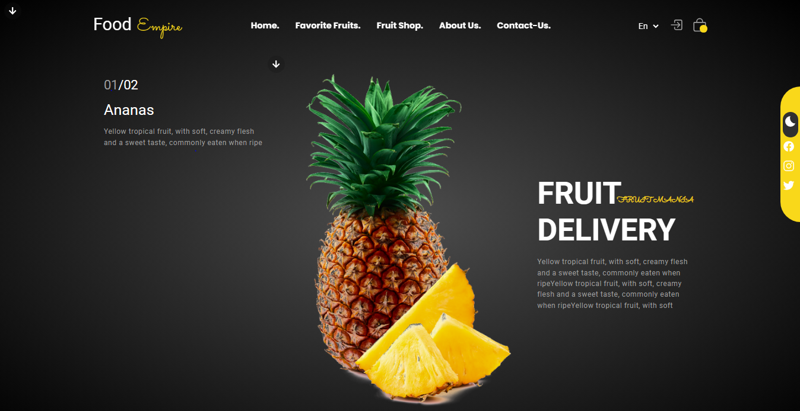

# Fruit Shop Website

Welcome to the Fruit Shop website! This website is designed to showcase a variety of fresh and delicious fruits available for delivery. Whether you're a fruit enthusiast or just looking for healthy snacks, our Fruit Shop has something for everyone.

## Table of Contents

- [Introduction](#introduction)
- [Features](#features)
- [Technologies Used](#technologies-used)
- [Setup Instructions](#setup-instructions)
- [Usage](#usage)
- [Contributing](#contributing)
- [License](#license)

## 🚀 Demo

## Live Demo [👉🏻 Here♥️](https://eng-ahmed-hussien.github.io/Fruit-shop/)

## Project Screenshots:

## Overview
The Fruit Shop website is designed to showcase a variety of fresh fruits and related products offered by our shop. We aim to provide customers with a convenient and visually appealing platform to explore and purchase their favorite fruits. The website is built using HTML, CSS, and JavaScript to ensure a seamless and responsive user experience across different devices.

## Introduction

The Fruit Shop website is a platform where users can explore a wide range of fruits, learn about their nutritional benefits, and conveniently place orders for delivery. With a user-friendly interface and beautiful design, our website aims to provide a seamless shopping experience for our customers.

## Features

- **Homepage**: Welcomes visitors with a vibrant display of fresh fruits and highlights seasonal offers.
- **Shop**: Allows customers to browse through different categories of fruits and make purchases online.
- **About Us**: Provides insights into our store's history, values, and commitment to quality.
- **Special Offers**: Showcases special discounts and promotions to attract customers.
- **Recipes**: Offers delicious fruit recipes and serving suggestions to inspire healthy eating habits.
- **Contact Us**: Provides contact information and a form for inquiries, feedback, and support.- Browse through a diverse selection of fresh fruits.
- View detailed descriptions and nutritional information for each fruit.
- Easily add fruits to your shopping cart and proceed to checkout.
- Responsive design ensures a seamless experience across various devices.

## Structure

The website is structured into different sections accessible via the navigation menu:

- **Home**: Introduces the store and highlights featured products and offers.
- **Shop**: Displays categories of fruits available for purchase, with options for filtering and sorting.
- **About Us**: Shares information about the store's background, mission, and dedication to freshness.
- **Special Offers**: Highlights ongoing promotions and discounts to encourage sales.
- **Recipes**: Provides a collection of fruit-based recipes, serving ideas, and nutritional information.
- **Contact Us**: Offers ways for customers to get in touch with us for inquiries, feedback, and support.

## How to Use

1. **Navigation**: Use the menu to navigate to different sections of the website.
2. **Shop**: Explore the variety of fruits available and add desired items to the cart for purchase.
3. **Special Offers**: Check out the latest promotions and discounts to save on your purchases.
4. **Recipes**: Get inspired by delicious fruit recipes and serving suggestions for healthy eating.
5. **Contact Us**: Reach out to us for any inquiries, feedback, or support needs.

## Technologies Used

- HTML5
- CSS3 (including AOS library for animations)
- JavaScript
- Ionicons
- Open Graph Protocol for social media sharing
- AOS library for animations

## Setup Instructions

1. Clone this repository to your local machine.
2. Open the `index.html` file in your web browser to view the website.

## Usage

- Navigate through the website using the navigation menu.
- Explore different sections such as "Favorite Fruits" and "Fruit Shop" to discover a variety of fruits.
- Click on the "Buy Now" button to add fruits to your cart and proceed to checkout.

## Contributing

Contributions are welcome! If you find any bugs or have suggestions for improvement, please feel free to open an issue or submit a pull request.

## Author

This website was designed and developed by [Ahmed Hussien]. Connect with me on [GitHub](https://github.com/Eng-Ahmed-Hussien) for more projects.

Thank you for visiting the FreshFruit Shop website! We hope you enjoy exploring our selection of fresh and delicious fruits. 🍎🍌🍇

## License

This project is licensed under the [MIT License](LICENSE).
